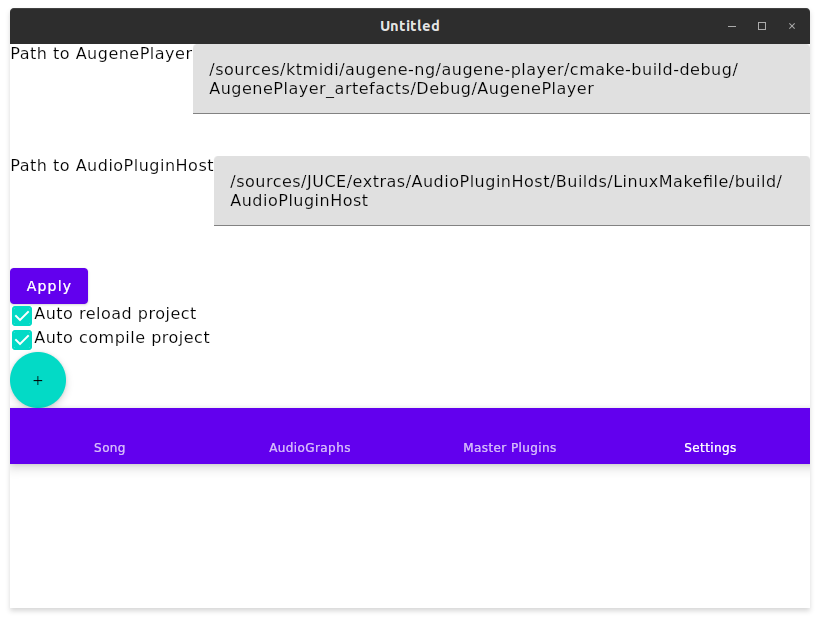
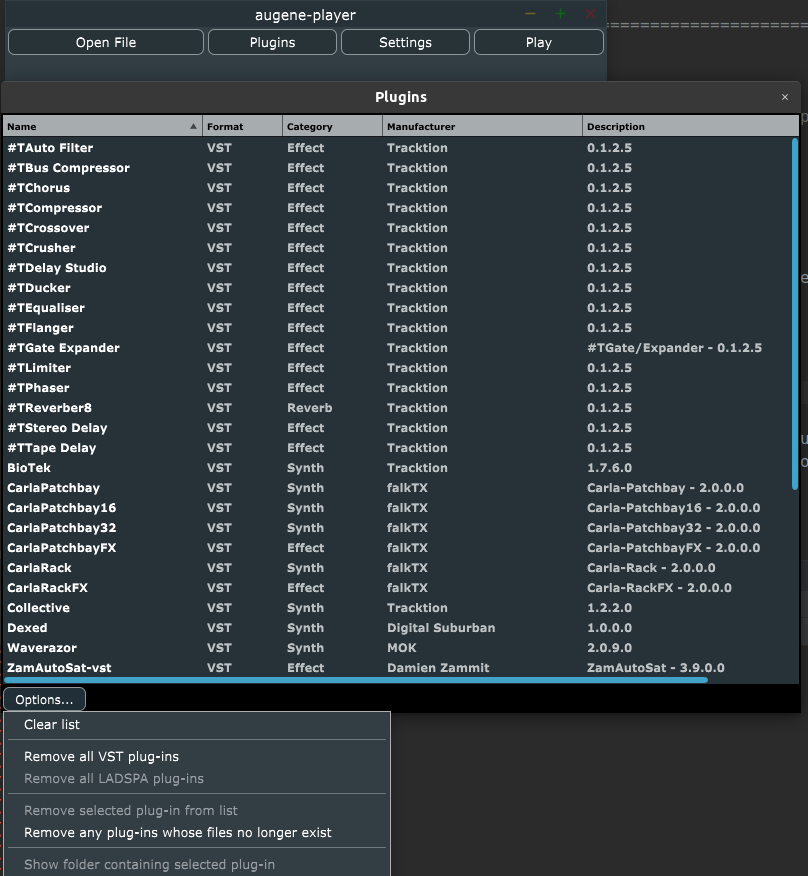

# augene-ng: MML compiler for audio plugins sequencer engine

[](http://www.youtube.com/watch?v=tImmG0JWBP4 "augene-ng demo 2021-10-28")

augene(-ng, next gen) is an experimental compound music authoring toolchain that brings old-fashion MML (music macro language) compiler integrated into modern sequencer that is also used in Tracktion Waveform DAW (so far). It is nothing but a proof of concept so far, whilst I (@atsushieno) plan to use it for own production.

You can also have a quick glance at the project by [my slides for lightening talk at ADC 2019](https://speakerdeck.com/atsushieno/create-music-in-199x-language-for-2019-sequencer) for a bit more details.

The application consists of the following software and libraries behind:

- The project model implemented in this repository which contains a set of MML sources and associated audio plugin filter graphs, converts SMF to audio plugin based songs (.tracktionedit)
- MML compiler [mugene-ng](https://github.com/atsushieno/mugene-ng) - compiles MML into SMF.
- [JUCE](https://github.com/juce-framework/JUCE) AudioPluginHost for editing audio graph.
- [tracktion_engine](https://github.com/Tracktion/tracktion_engine/) - music playback engine.
- [Compose for Desktop](https://github.com/JetBrains/compose-jb), cross-platform desktop port of Jetpack Compose. (The application itself is desktop-only, so far, as it depends on a lot of desktop filesystem idioms.)


# Usage

NOTE: before using augene, you most likely have to build things (explained in the next section).

launch `augene-editor` application. It is a cross-platform Kotlin/JVM Compose for Desktop GUI application.



By default those lists are actually empty. It's a screenshot of the app that has loaded sample data that makes use of VST3 plugins.

To use this app, there are couple of things to do - Configure the app. Namely paths to two external tools are needed:

- augene-player (JUCE app in this repository, which is mostly based on PlaybackDemo in tracktion_engine repository)
- AudioPluginHost (can be found in JUCE extras)

The next step is to build a list of locally installed audio plugins. Begin with "Plugins" button to start the process.


Once you are done with above, then you're ready to use the app. You can open a `*.tracktionedit` file and play it. Note that if you don't have the audio plugins specified in the edit file, you are unable to play it.

To compose your own music, create new audiograph and new MML for each list, which can be performed via the buttons on each tab. Then use "Compile" command from the FAB (floating action button).


# Building

## augene-player

There are two primary steps to build the whole "augene" application. The first step is "augene-player" part, which is a JUCE based C++ application. It is a typical JUCE application project. You can build it with the following steps:

```
cd augene-player
ln -s ../external/tracktion_engine/modules/juce juce-symlink
mkdir build
cd build
cmake ..
make
```

### Enabling VST2

It is not confirmed in augene-ng era, but if you have VST2 SDK and would like to add support for VST2, open AugenePlayer.jucer in Projucer (and probably AudioPluginHost.jucer if you once tried to build it from build.sh) on Projucer and select `juce_audio_processors` module and enable VST(2) there, then save project.

## kotractive, augene, and augene-editor

Another chunk of the application is the augene project builder (or "editor") which builds Compose for Desktop based GUI app/tool.

Due to current limitation of Kotlin Multiplatform project structure, there are 3 projects to just build one single app... :

- `kotractive`, which provides basic "tracktionedit" file data model using [`ksp`](https://github.com/google/ksp/), in Kotlin Multiplatform
- `augene`, which provides Augene project data model and manipulator API, in Kotlin Multiplatform
- `augene-editor`, which is a GUI application project using Compose for Desktop Multiplatform, JVM-only

```
$ cd kotracktive && ./gradlew publishToMavenLocal && cd ..
$ cd augene && ./gradlew publishToMavenLocal && cd ..
$ cd augene-editor && ./gradlew package && cd ..
```


## Android build

AugenePlayer is being ported to Android as [aap-juce-augene](https://github.com/atsushieno/aap-juce-augene). It still does not successfully run, and player only.

# Augene project data format

An augene project is a simple set of XML described in a project file which looks like this:

```
<AugeneProject xmlns:xsd="http://www.w3.org/2001/XMLSchema" xmlns:xsi="http://www.w3.org/2001/XMLSchema-instance">
  <Includes>
    <Include Bank="1" Source="Banks/SfzBanks.augene" />
    <Include Bank="2" Source="Banks/SF2Banks.augene" />
    <Include Bank="3" Source="Banks/SurgeBanks.augene" />
  </Includes>
  <MasterPlugins>
    <MasterPlugin>MasterPlugin1.filtergraph</MasterPlugin>
  </MasterPlugins>
  <AudioGraphs>
    <AudioGraph Id="GrandPiano1" Source="sfizz_city_piano_1.filtergraph" />
  </AudioGraphs>
  <Tracks>
    <AugeneTrack>
      <Id>1</Id>
      <AudioGraph>Unnamed.filtergraph</AudioGraph>
    </AugeneTrack>
  </Tracks>
  <MmlFiles>
    <MmlFile>foobar.mugene</MmlFile>
  </MmlFiles>
  <MmlStrings>
    <MmlString>![CDATA[ 1 @0 V110 v100 o5 l8 cegcegeg  > c1 ]]></MmlString>
  </MmlStrings>
</AugeneProject>
```

Here is a list of elements:

| Element | feature |
|-|-|
| AugeneProject | the root element |
| Includes | container of `Include` elements. |
| Include | include other project files. They can also be a bank list of AudioGraph. See description below. |
| AudioGraphs | container of `AudioGraph` elements. |
| AudioGraph | gives a filtergraph a name so that it can be referenced by `AudioGraph` element within `AugeneTrack` element. |
| MasterPlugins | holds a list of master plugins |
| MasterPlugin | specifies an AudioGraph file that is used as a master plugin |
| Tracks | holds a list of tracks |
| AugeneTrack | a track definition specifier which holds an Id and an AudioGraph file (so far only one plugin is specified. Rooms for improvements. |
| MmlFiles | holds a list of MML files |
| MmlFile | specifies an MML source file to be compiled and converted to the edit file. |
| MmlStrings | holds a list of MML strings |
| MmlString | specifies an MML string to be compiled and converted to the edit file. |

An Augene project can include other Augene project files using `Include` element. It is useful to represent a bank of preset filtergraphs. On an `Include` element, `Bank` and `BankMsb` attributes indicate bank select MSB, `BankLsb` attribute indicates bank select LSB (`Bank` is equivalent to `BankMsb` here). `Source` attribute indicates the *included* file path, relative to the *including* file path.

An `AudioGraph` can be referenced by its `Id` attribute, by (1) mugene MIDI track with `INSTRUMENTNAME` meta event, or (2) `AudioGraph` attribute on `AugeneTrack` elements.

All tracks in either MML format (file or string) are converted into tracktionedit. Then audio graphs in the project are interpreted and converted to `PLUGIN` element in tracktionedit and then for each defined track by `Tracks` elements, if there is any graph whose `Id` is identical to the track's `AudioGraph` then the audio graph is attached to the track.

One thing to note is that while mugene supports track number in double (floating point number) SMF does not have "track numbers" and numbers are counted only by sequential index (0, 1, 2...),  the mappings could be totally different. It is always safer to indicate audio graph by INSTRUMENTNAME meta event in mugene MML, or supplementally use `AugeneTrack`'s mappings.

## Controlling audio plugin parameters by MML via automation tracks

mugene is designed to generate music as in MIDI files, which has no concept of audio plugins and their parameters. augene (namely its `Midi2TracktionEditConverter`) has special support for controlling them via Tracktion's "Automation Tracks".

To understand how augene supports them, we should understand how a `.tracktionedit` XML file represents audio plugin parameter controllers via automation tracks.

`<AUTOMATIONTRACK>` elements can be created inside a `<TRACK>` element, and each `<AUTOMATIONTRACK>` has `currentAutoParamPluginID` attribute that indicates a `<PLUGIN>` element by its `id` (not to be confused with `uid` or `uniqueId`), and `currentAutoParamTag` attribute that indicates the parameter index for the `<PLUGIN>`. The `<AUTOMATIONTRACK>` has no actual parameter data controllers though - they are in the `<PLUGIN>` element. It can contain `<AUTOMATIONCURVE>` elements, and each of them has a `paramID` attribute that indicates the parameter index, and a number of `<POINT>` elements where each of them has `t` attribute (time) and `v` attribute (value) (TBD: there is also `c` attribute whose role is unknown).

Here is an example track (excerpt):

```
  <TRACK extension:InstrumentName="opn" id="1">
    ...
    <AUTOMATIONTRACK currentAutoParamPluginID="1997591454" currentAutoParamTag="4" id="-1507545692">
      <MACROPARAMETERS id="212771437" />
      <MODIFIERS />
    </AUTOMATIONTRACK>
    <PLUGIN type="vst" uid="a83aaba6" filename="/home/atsushi/.vst3/OPNplug.vst3" name="OPNplug" manufacturer="Jean Pierre Cimalando" id="1997591454" enabled="1" programNum="0" state="...">
      <AUTOMATIONCURVE paramID="4">
        <POINT t="0.0" v="4096.0" c="0.0" />
      </AUTOMATIONCURVE>
    </PLUGIN>
    ...
  </TRACK>
```

Now, its our (augene's, particularly its `Midi2TracktionEditConverter`'s) role on how to generate them from an SMF. We use system exclusive messages that indicate "we are augene-ng automation controllers". To identify that, system exclusives with `7Dh` sysex manufacturer ID (general research / development use), followed by 9 bytes `augene-ng` characters, is used. Then the next byte is used to distinguish two different controls:

- `00h` to indicate the actual parameter control: the next two bytes represents the parameter ID by LSB and MSB, then the next two bytes for the parameter value LSB and MSB.
- non-zero byte to indicate a string length, followed by the actual ASCII string that indicates the plugin's unique ID (`uid` or `uniqueID`) that is being used from there in the track.

Indicating plugin's unique ID and parameter index is not intuitive for MML authoring. It's better to use some macros that wraps those constants. There is a helper Node.JS script `generate-automation-helper.js` that parses `~/.config/augene-ng/plugin-metadata.json` and generates a bunch of `.mugene` MML files for each audio plugins that are listed within the JSON, into `~/.config/augene-ng/audio-plugins` directory. The generated MML looks like this:

```
#macro AUDIO_PLUGIN_USE nameLen:number, ident:string {  __MIDI #F0, #7D, "augene-ng", $nameLen, $ident, #F7 }
#macro AUDIO_PLUGIN_PARAMETER parameterID:number, val:number { \
    __MIDI #F0, #7D, "augene-ng", 0, \
    $parameterID % #80, $parameterID / #80, $val % #80, $val / #80 } 

#macro OPNPLUG { AUDIO_PLUGIN_USE 11, "-1472549978" }
#macro OPNPLUG_MASTER_VOLUME val { AUDIO_PLUGIN_PARAMETER 0, $val }
#macro OPNPLUG_EMULATOR val { AUDIO_PLUGIN_PARAMETER 1, $val }
#macro OPNPLUG_CHIP_COUNT val { AUDIO_PLUGIN_PARAMETER 2, $val }
#macro OPNPLUG_CHIP_TYPE val { AUDIO_PLUGIN_PARAMETER 3, $val }
#macro OPNPLUG__PART_\1__OPERATOR_\1_LEVEL val { AUDIO_PLUGIN_PARAMETER 4, $val }
...
```

Then you can `#include` this macro, and write your track MML like:

```
// not quite sure if this 127 works just as 127, you might need some multiplication
1	INSTRUMENTNAME "opn" CH0 @1 OPNPLUG OPNPLUG_PART\1_OPERATOR\1_LEVEL 127
```

Wherever you have the same set of audio plugins installed on your system, you can generate the same set of macro definitions and therefore the MML should be compatible across environment, whereas the plugin unique IDs might be different.


# License

The augene-player part (JUCE application) is released under the GPLv3 license.

The kotlin projects are released under the MIT license.


## Dependencies

There are couple of dependencies in this application:

- [JUCE](https://juce.com/) - GPLv3 (or commercial).
- [Tracktion/tracktion_engine](https://github.com/Tracktion/tracktion_engine/) - ditto.
- [lvtk/jlv2](https://github.com/lvtk/jlv2) - ditto (in jlv2_host).
- [SpartanJ/efsw](https://github.com/SpartanJ/efsw) - MIT.
- [dogla/filesystem-watcher](https://github.com/dogla/filesystem-watcher) - Apache 2.0. The sources are converted from Java to Kotlin and directly embedded in augene-editor-project.

